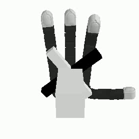

# Allegro & Digit Tactile Sensing Hand Manipulation

## Description
Exploring the usage of tactile sensing in hand manipulation

## Simulation
### Overview
TACTO: https://github.com/facebookresearch/tacto
refer to the link for installation instructions
### Using TACTO to simulate & train agents
#### 1. Valve Agent
Placeholder text...

## Physical Testing
### Overview
Placeholder text...
.gif)

### Sim-to-real
Placeholder text...

### Discussion
Placeholder text...

## Links
- [Project Documentation](#)
- [Simulation Code Repository](#)
- [Physical Testing Data](#)
- [Related Research Papers](#)

---
