# Simulation

## Overview
- [TACTO](https://github.com/facebookresearch/tacto) serves as the simulation platform. Refer to the documentation for installation and instructions.
- [Stable-Baselines3](https://stable-baselines3.readthedocs.io/en/master/) provides implementations of reinforcement learning algorithms in PyTorch.
- [Gymnasium](https://github.com/Farama-Foundation/Gymnasium) is the base gym environment for agent training.

---

The purpose of the simulation is to explore the possibilities of the robot hand by training RL agents to complete suitable hand manipulation tasks before replicating them in real life. The simulation platform allows for sim-to-real transfer by pre-training agents in a simulation before training them in real-world environments.

## Using TACTO to Simulate & Train Agents

### 1. Valve Agent
The first step of the project is to train a simple valve-turning agent to rotate a valve handle by 180 degrees.


---
### 2. Bottle Cap Rotating Agent
This agent is designed to better utilize the capabilities of the framework. Here, we apply PCA to extract key components of the tactile images, allowing the agent to learn from the entire observation while drastically reducing the observation space. The PCA is applied to a set of 500 depth images to choose 15 principal components:

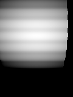 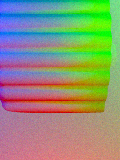  
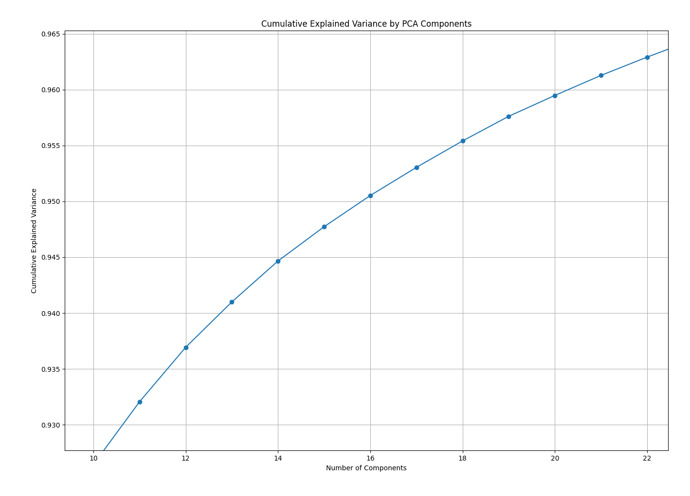

PCA image reconstruction:
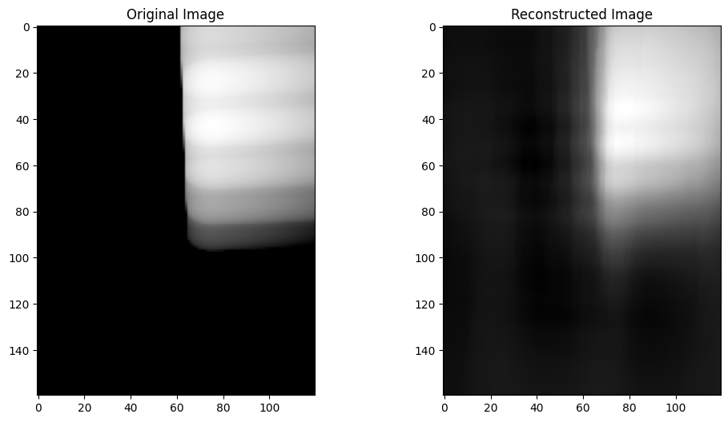 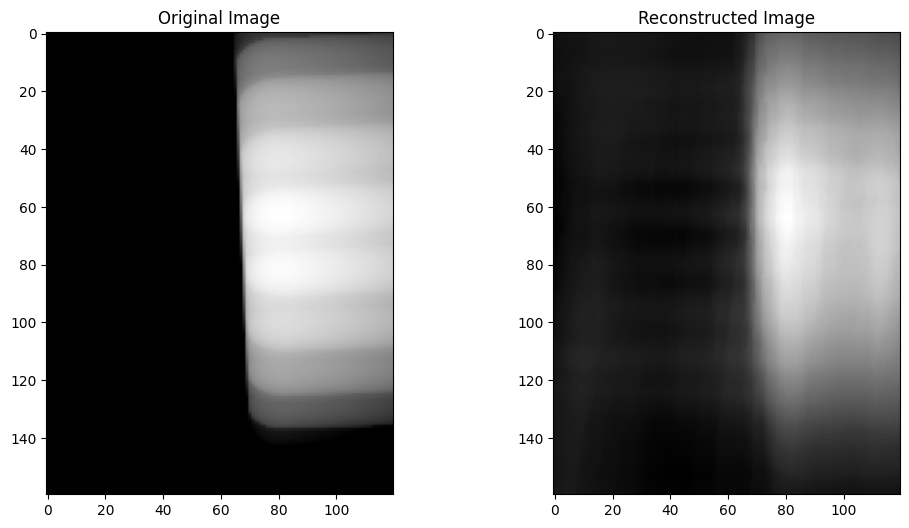 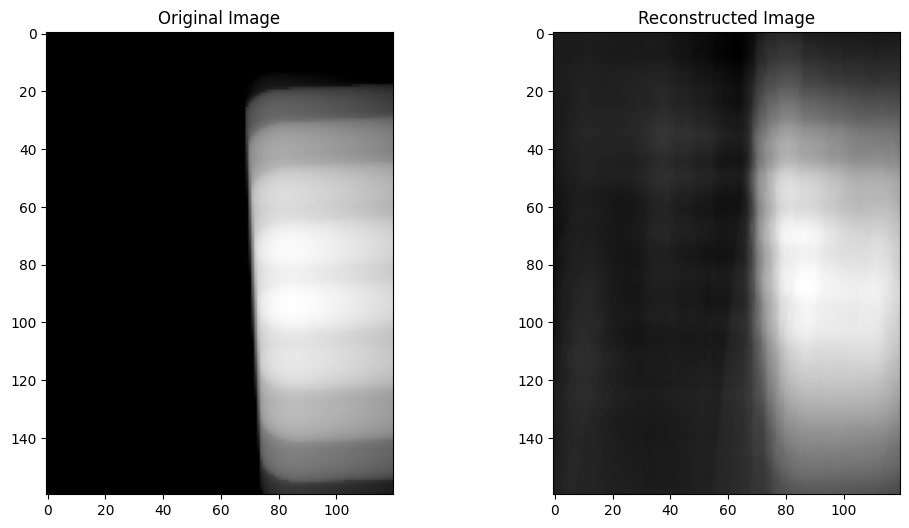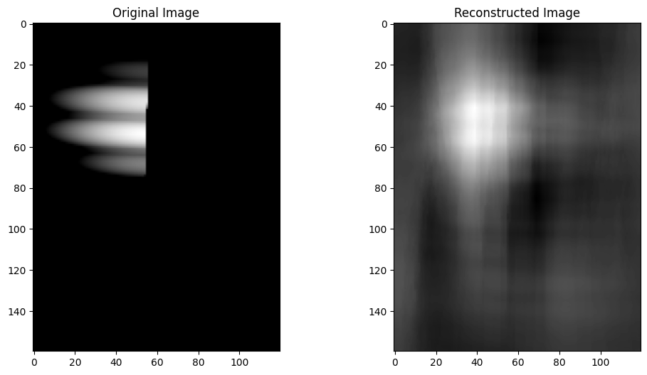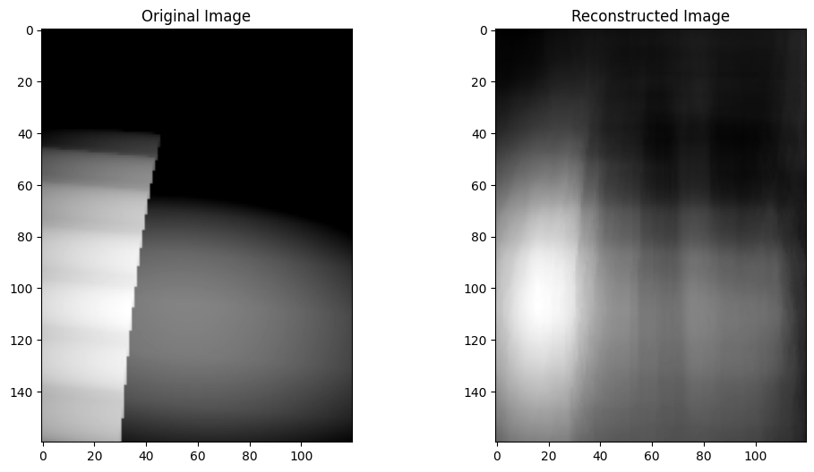

Cases to keep an eye on - first image: no contact & second image: full contact (both relatively common in the simulation)
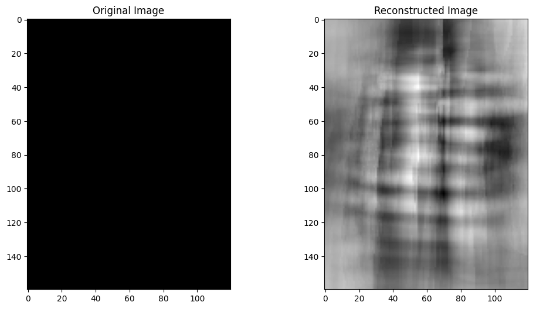 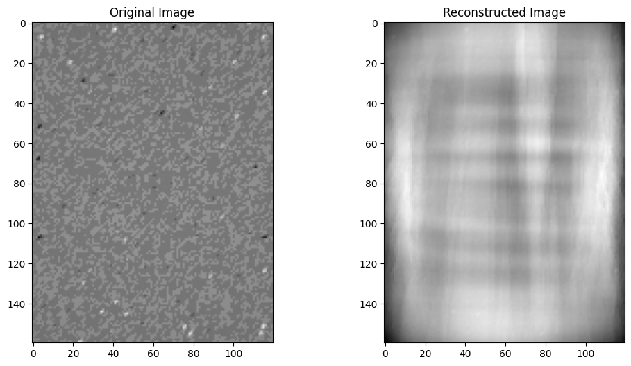

Initial training results:

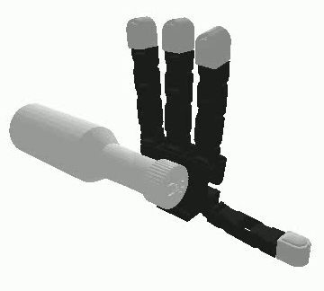
---
## Physical Testing

### Overview
Placeholder text...

.gif)

### Sim-to-Real
To bridge sim to real, TACTO provides an ability to change the background of the simulated sensor, so both simulated and real tactile images can be used with PCA's or VAE's

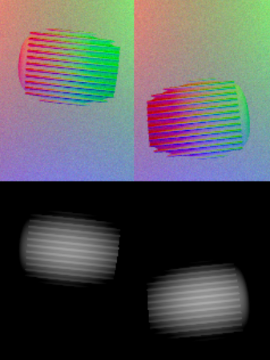

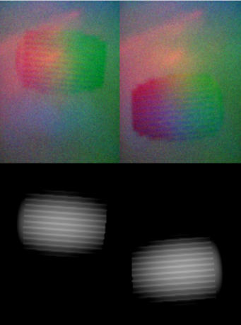

This is achived by simply adding an image background to the digit sensor when creating it:
```python
bg = cv2.imread("path/to/image.jpg")
digits = tacto.Sensor(**cfg.tacto, background=bg)
```

### Discussion
Placeholder text...

## Links
- [Project Repository](https://github.com/trannguyenle95/multifingered-tactile)
- [Related Research Papers](#)

---
