This is a documentation of a robotics project to whom ever it may interest. This project page acts as a general overview of the research done in the 2-month working period regarding dexterous manipulation with a visuo-tactile multi-finger hand at Aalto University - School of Electrical Engineering. The project builds the tools to conduct further research among closely related topics and will see further research during the Spring of 2025. Further research will aim to strike a balance in reducing the dimension of the tactile data while simultaneously extracting the most meaningful data for an RL-agent to learn as well and efficiently as possible.

# Simulation

## Overview
- [TACTO](https://github.com/facebookresearch/tacto) is a Pybullet based physics simulator that serves as the simulation platform for this project. Refer to the documentation for installation and instructions.
- [Stable-Baselines3](https://stable-baselines3.readthedocs.io/en/master/) provides implementations of reinforcement learning algorithms in PyTorch.
- [Gymnasium](https://github.com/Farama-Foundation/Gymnasium) is the base gym environment for agent training.

---

The purpose of the simulation is to explore the possibilities of the robot hand by training RL agents to complete suitable hand manipulation tasks before replicating them in real life. The simulation platform allows for sim-to-real transfer by pre-training agents in a simulation before training them in real-world environments.

## Using TACTO to Simulate & Train Agents

### 1. Valve Agent
The first step of the project is to train a simple valve-turning agent to rotate a valve handle by 180 degrees. This basic example showcases and tests the now built framework for training RL agents in our environment.

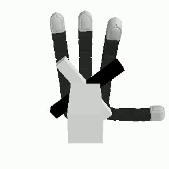
---
### 2. Bottle Cap Rotating Agent
This agent is designed to better utilize the capabilities of the framework. Here, we apply PCA to extract key components of the tactile images, allowing the agent to still learn from the entire observation while drastically reducing the observation space thus reducing the computational costs significantly. The PCA is applied to a set of 500 depth images to choose 15 principal components. The following images first showcases an example depth image (black & white), and the second shows that we obtain a Cumulative explained variance of 0.95 when choosing 15-16 principal components:

 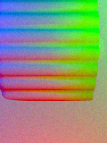  
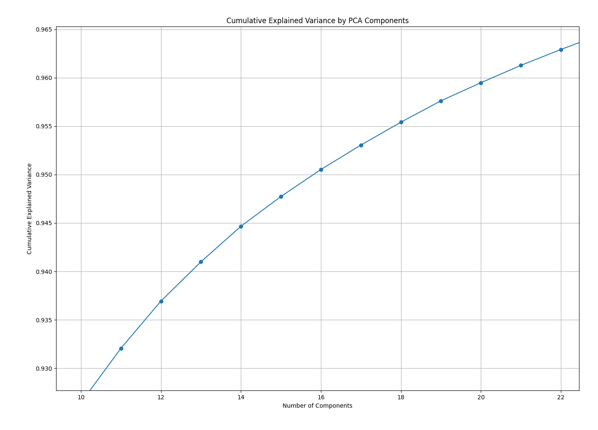

PCA image reconstruction:
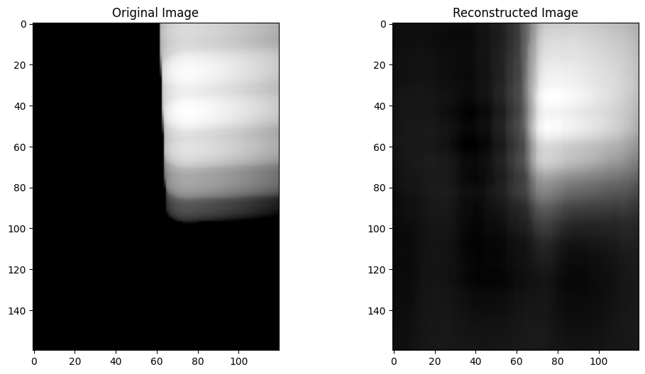 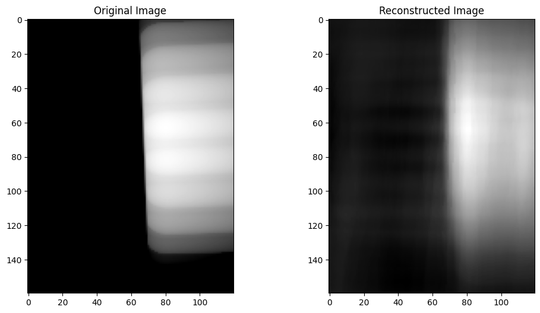 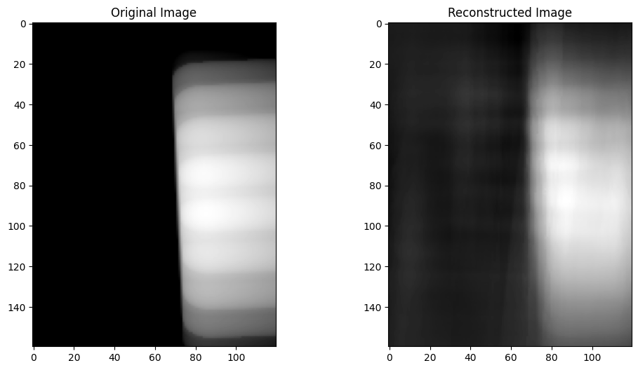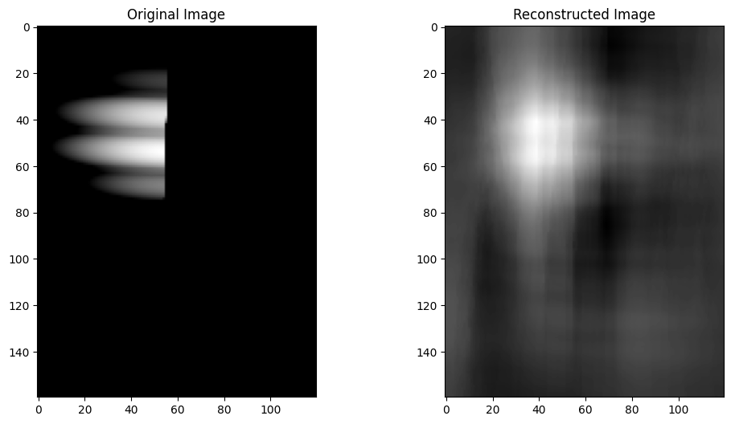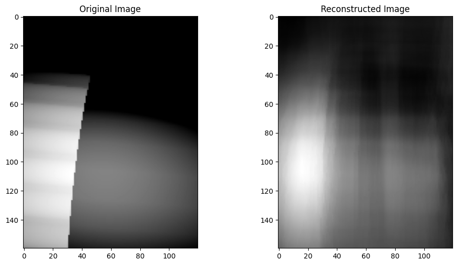

Initial training results:

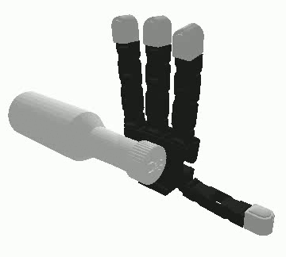
---
## Physical Testing

### Overview
The University offers the multi-finger hand as a testing tool to try out trained policies in the real world. However, sim2real transfers are yet to be made in this project as they will expectedly increase the scope of the research. If you're interested in this,  a paper by Entong Su et al. may be interesting: [Sim2Real Manipulation on Unknown Objects with Tactile-based Reinforcement Learning](https://arxiv.org/abs/2403.12170)

.gif)

### Sim-to-Real
Below is shown an example on how to apply a sensor specific image to the simulator to closely match the color scheme and sensor specific flaws in the simulator as well:

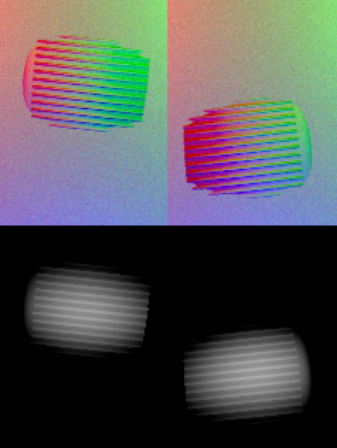

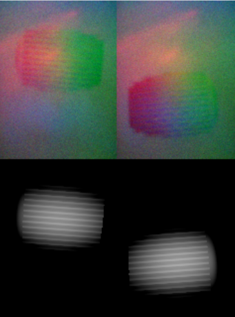

This is achived by simply adding an image background to the digit sensor when creating it:
```python
bg = cv2.imread("path/to/image.jpg")
digits = tacto.Sensor(**cfg.tacto, background=bg)
```

### Discussion
Currently, the project serves as a tentative foundation for a future Master's thesis. The exact topic of the thesis is currently being explored.

## Links
- [Project Repository](https://github.com/trannguyenle95/multifingered-tactile)
---
